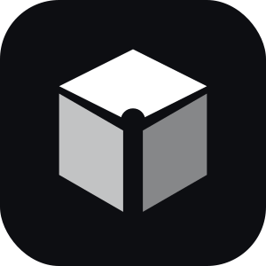
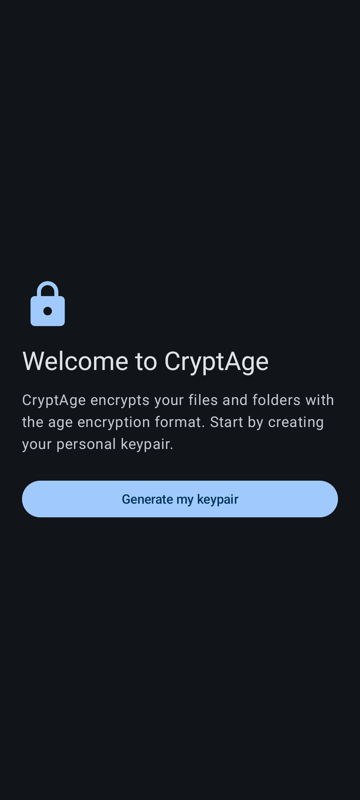
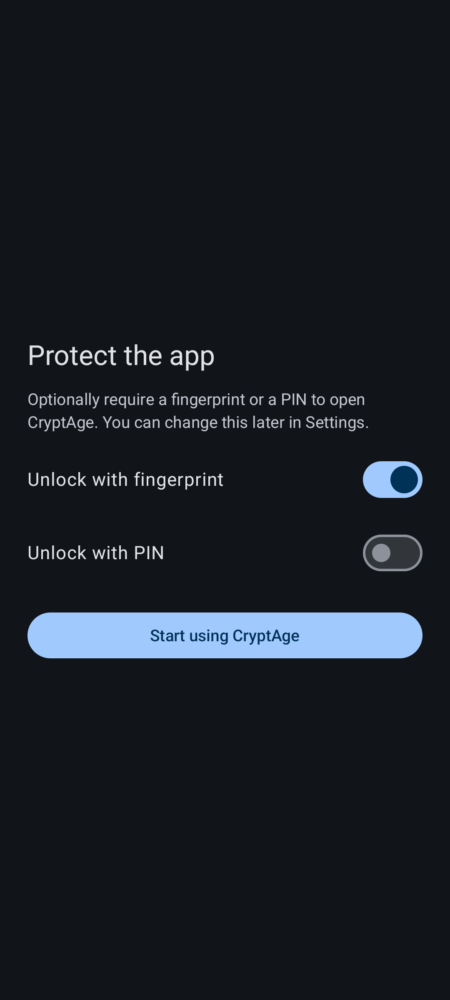
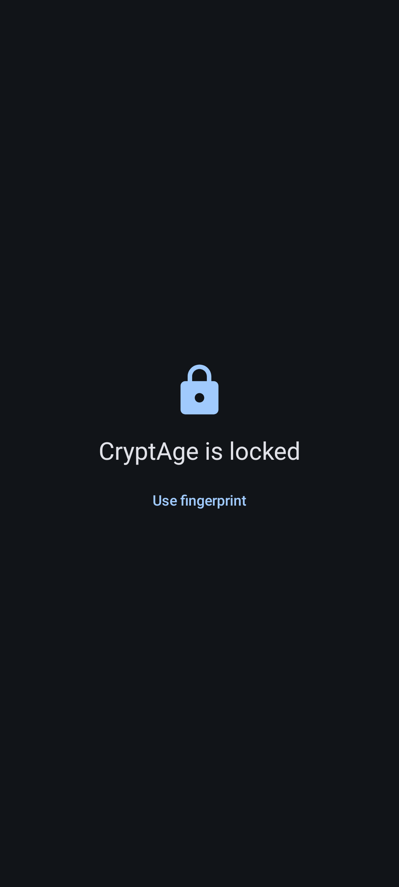
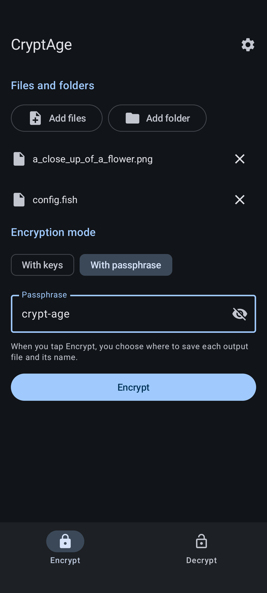
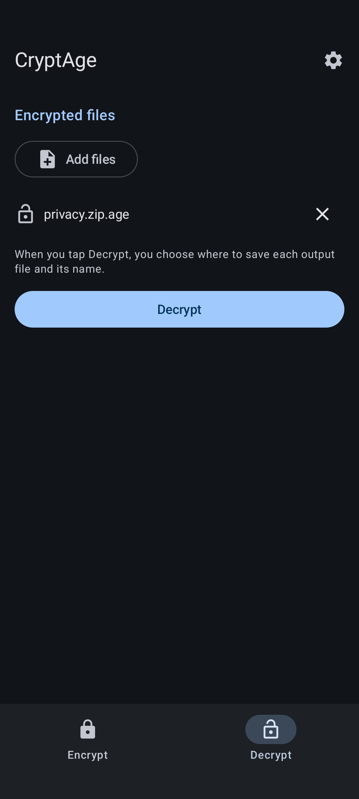
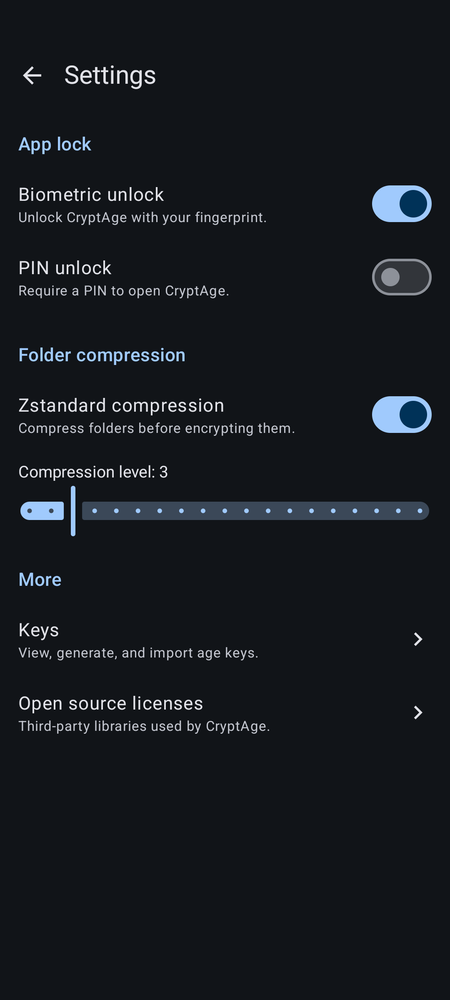
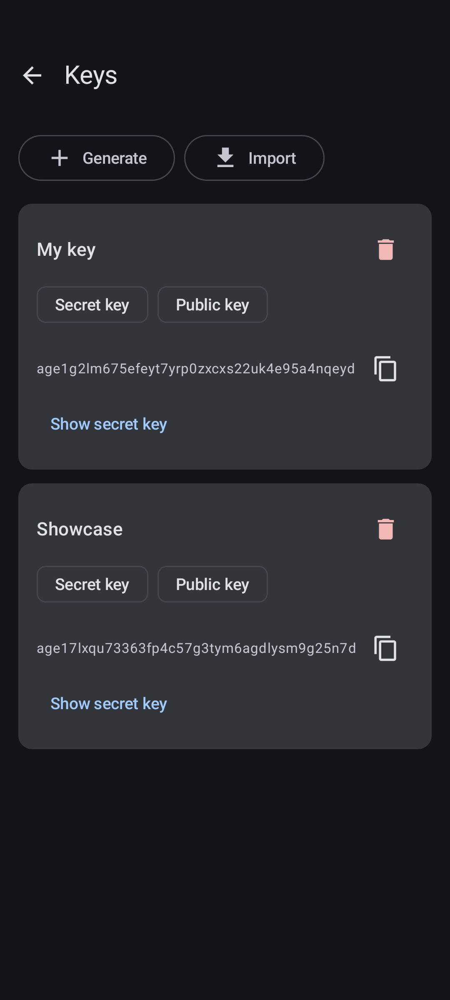

<p align="center">
  
</p>

<h1 align="center">CryptAge</h1>

---

CryptAge is a native Android app for encrypting and decrypting files and folders with the [age](https://age-encryption.org) file encryption format, built on [kage](https://github.com/android-password-store/kage), with Zstandard folder archiving and a Material You (Material 3) interface.

## Screenshots

<p align="center">
  
  
  
  
</p>
<p align="center">
  
  
  
</p>

## Features

- Encrypt and decrypt files with age: key-based (recipients/identities) and passphrase-based (scrypt) modes; decrypt auto-detects the mode from the age header.
- Streaming end to end: arbitrarily large files without loading them into memory.
- Batch processing with per-file progress and per-file error isolation.
- Folder encryption: tar + zstd archive, then age-encrypt; decryption reverses it. Zstd parameters adjustable in Settings.
- Named key management: generate keypairs, import secret/public keys, encrypt to multiple recipients. Secret keys stored encrypted at rest (Android Keystore-backed).
- Optional app lock with biometrics and/or PIN.
- Output saved where you choose via the Storage Access Framework; `.age` naming handled automatically.
- Material You dynamic color following the system light/dark setting, themed-icon support.
- English UI, fully resource-based and ready for additional languages.

Requires Android 12 (API 31) or newer. Supports arm64-v8a, armeabi-v7a, x86, and x86_64.

## Building

Requirements: JDK 21 and the Android SDK (compileSdk 36). The Gradle wrapper handles the rest.

```
./gradlew :app:assembleRelease
```

Release signing is read from the environment (`SIGNING_KEYSTORE_PATH`, `SIGNING_KEYSTORE_PASSWORD`, `SIGNING_KEY_ALIAS`, `SIGNING_KEY_PASSWORD`). Without these, a local build falls back gracefully to an unsigned release output.

Continuous integration: every push triggers a GitHub Actions workflow that builds and signs the release APK (`CryptAge.apk`) using repository secrets, and uploads it as a build artifact.

## License

CryptAge is free software, licensed under the GNU General Public License version 3 or (at your option) any later version. See [LICENSE](LICENSE) for the full text.

CryptAge is distributed in the hope that it will be useful, but WITHOUT ANY WARRANTY; without even the implied warranty of MERCHANTABILITY or FITNESS FOR A PARTICULAR PURPOSE.

## Acknowledgements

CryptAge builds on the work of these open-source projects:

| Project | Use | License |
|---|---|---|
| [kage](https://github.com/android-password-store/kage) | age encryption/decryption and key handling | Apache-2.0 |
| [age](https://age-encryption.org) (specification) | encryption format | — |
| [zstd-jni](https://github.com/luben/zstd-jni) | Zstandard bindings (native libraries included) | BSD-2-Clause |
| [Zstandard](https://facebook.github.io/zstd/) | compression algorithm | BSD-3-Clause |
| [Apache Commons Compress](https://commons.apache.org/compress/) | tar archiving | Apache-2.0 |
| [Kotlin](https://kotlinlang.org) & [KotlinX Coroutines](https://github.com/Kotlin/kotlinx.coroutines) | language and concurrency | Apache-2.0 |
| [Jetpack Compose / Material 3](https://developer.android.com/compose) | UI toolkit | Apache-2.0 |
| [AndroidX](https://developer.android.com/jetpack/androidx) (Activity, Lifecycle, Navigation 3, DataStore, Biometric, DocumentFile) | platform components | Apache-2.0 |
| [Tink](https://developers.google.com/tink) | at-rest encryption of stored keys | Apache-2.0 |

The full list with versions is also available in the app under Settings → Open Source Licenses.
